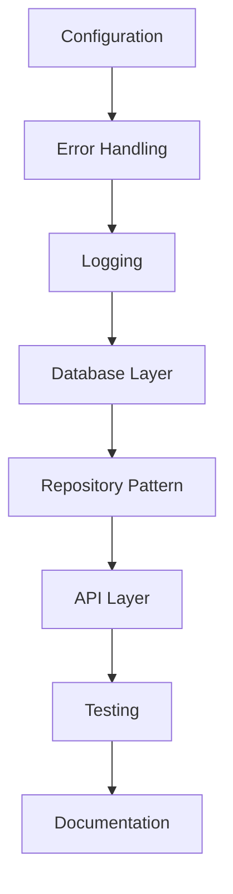

# Refactoring Plan

## Phase 1: Configuration Management
- [x] Create `internal/app` package for configuration
- [x] Move configuration from `internal/config` to `internal/app`
- [x] Update all imports to use new package names
- [x] Add comprehensive tests for configuration
- [x] Update main application to use new configuration

## Phase 2: Package Organization
- [x] Rename `battleship` package to `game`
- [x] Rename `database` package to `storage`
- [x] Consolidate HTTP handlers with server package
- [x] Update all imports and references
- [x] Add documentation for new structure

## Phase 3: Testing and Documentation
- [ ] Add unit tests for all packages
- [ ] Add integration tests
- [ ] Update API documentation
- [ ] Add deployment guides
- [ ] Add monitoring setup

## Phase 4: Performance and Security
- [ ] Implement caching layer
- [ ] Add rate limiting
- [ ] Implement authentication
- [ ] Add input validation
- [ ] Set up monitoring

## Dependencies

## Success Criteria

1. All tests passing
2. Code coverage > 80%
3. No critical security issues
4. Documentation complete
5. Performance metrics met
6. All linting rules satisfied

## Risk Mitigation

1. **Database Migration Risks**
   - Create backup strategy
   - Test migrations thoroughly
   - Plan rollback procedures

2. **API Changes**
   - Version API endpoints
   - Maintain backward compatibility
   - Document breaking changes

3. **Performance Impact**
   - Monitor metrics during changes
   - Test under load
   - Plan performance optimization

## Progress Tracking

- Daily updates to this document
- Weekly progress reviews
- Milestone tracking
- Issue tracking in GitHub

## Next Steps

1. Review and approve plan
2. Set up tracking infrastructure
3. Begin Phase 1 implementation
4. Schedule regular reviews 